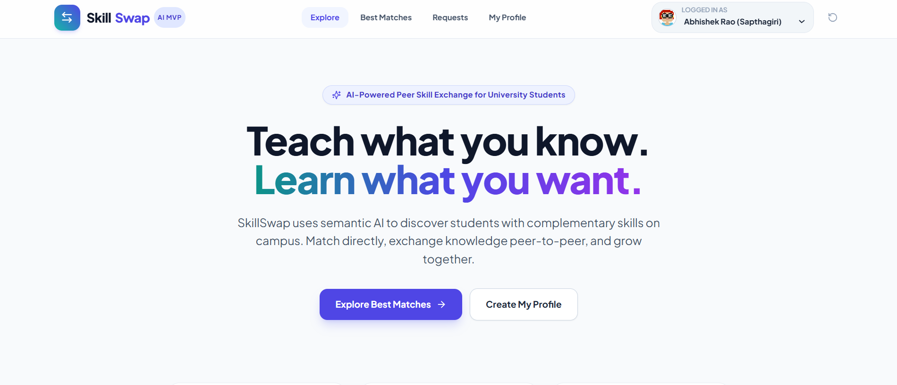
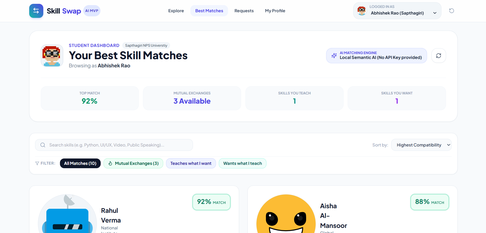
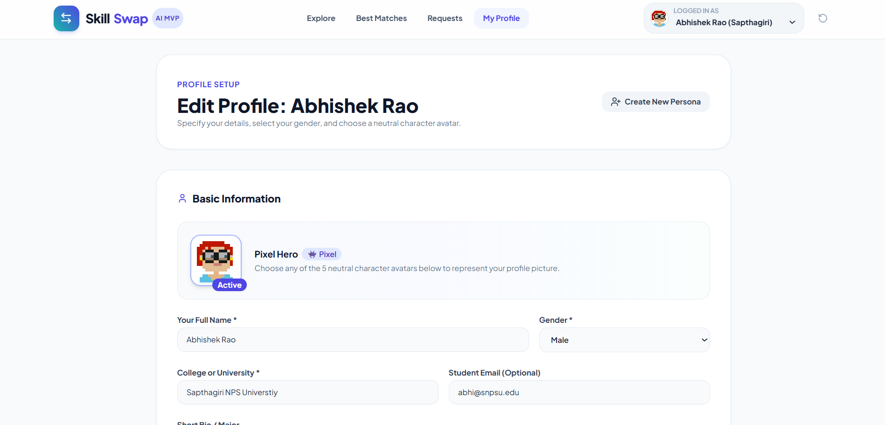

# SkillSwap 🔄 | AI-Powered Student Skill Exchange Platform
SkillSwap uses semantic AI to discover students with complementary skills on campus. Match directly, exchange knowledge peer-to-peer, and grow together.

> **"Teach what you know. Learn what you want."**  
> SkillSwap is an intelligent, reciprocal skill-exchange platform tailored for university students. Using AI, it analyzes natural-language skill descriptions, identifies bilateral complementary pairings (e.g., Python ↔ UI/UX Design), and calculates compatibility scores to recommend peer mentors on campus.

---

## 🌟 Table of Contents
1. [The Problem & Vision](#-the-problem--vision)
2. [Key Features](#-key-features)
3. [How the App Works](#-how-the-app-works)
4. [Screenshots](#-screenshots)
5. [Architecture & Tech Stack](#-architecture--tech-stack)
6. [Project Structure](#-project-structure)
7. [Quick Start (Beginner's Step-by-Step Guide)](#-quick-start-beginners-step-by-step-guide)

---

## 🎯 The Problem & Vision

Many students have valuable technical or creative abilities they can teach, but also lack complementary skills for their side projects, coursework, or career goals.
- **Student A (Computer Science)** can teach **Python** but desperately needs to learn **UI/UX Design with Figma** to create portfolio apps.
- **Student B (Design)** can teach **UI/UX Design** but wants to learn **Python** for automated prototyping.

Without a smart platform, these students rarely find each other. **SkillSwap** solves this with an AI-first matching workflow:

$$\text{User Skills} \longrightarrow \text{AI Semantic Understanding} \longrightarrow \text{Bilateral Matching} \longrightarrow \text{Direct Connection}$$

---

## ✨ Key Features

1. **Natural-Language Skill Input:**
   Students aren't restricted to rigid dropdown tags. A student can enter *"I build backend APIs with Python"* and the AI semantically understands the connection to *"Python programming"*.
2. **AI Reciprocal Matching Engine:**
   Powered by Google Gemini 1.5 Flash (with structured JSON output). Evaluates target student needs against candidate skills to score compatibility ($0\%\text{–}100\%$) and formulate a customized suggested exchange ($A \leftrightarrow B$).
3. **Intelligent Local Fallback Matcher:**
   If no Gemini API key is configured or network is unavailable, SkillSwap automatically switches to an internal semantic clustering matcher. **Your hackathon demo will never crash on stage.**
4. **Student Matching Dashboard:**
   Sorted from highest compatibility to lowest. Clear visual cards showing:
   - Compatibility score ($90\%+$ Mutual Exchange, $60\%\text{–}85\%$ Strong Match)
   - Suggested Exchange banner
   - AI Reasoning explanation
   - Skill chips with experience levels (Beginner, Intermediate, Advanced)
5. **Real-Time Search & Filters:**
   Filter matches by keyword (e.g. *Python*, *Figma*, *Video*, *Pitching*), filter by Mutual Exchanges, or toggle between *"Skills I want to learn"* and *"Skills I can teach"*.
6. **One-Click Connect & Persona Switcher:**
   Interactive modal with pre-generated personalized outreach message and student email contact. Top-bar persona switcher lets you browse as different students during presentations.
7. **Pre-Seeded Complementary Dataset:**
   Includes 10 realistic university student profiles with intentionally paired complementary skill sets.
8. **Gender & Interactive Avatar Gallery:**
   Choose gender as **Male**, **Female**, or **Other**. Pick from gender presets or 5 neutral characters (*Nova Bot*, *Echo Spark*, *Pixel Hero*, *Sparky Emoji*, *Orbit Gear*) that do not imply gender.

---

## 🔄 How the App Works

SkillSwap guides students from describing their skills to arranging a peer-to-peer exchange. The main navigation gives access to **Explore**, **Best Matches**, **Requests**, and **My Profile**.

### 1. Start from Explore

The landing page introduces the exchange idea—teach a skill you already know and learn one you want—and offers shortcuts to browse matches or create a profile.

### 2. Create or update a student profile

In **My Profile**, provide your name and college, then optionally add a student email and short bio or major. Choose a gender and one of five neutral character avatars. Add at least one skill you can teach and one skill you want to learn; each skill can include a proficiency level and optional description. Save the profile to return to the matching dashboard. You can also create additional demo personas and switch between profiles using the navigation bar.

### 3. Browse personalized matches

**Best Matches** compares the active profile's teaching skills and learning goals with other student profiles. The dashboard shows the matching engine in use, your top compatibility score, mutual-exchange count, and the number of skills you teach and want to learn. Each match card includes a compatibility score, the proposed exchange, an explanation, and the other student's skills. Search by student, college, skill, or explanation; filter by mutual exchanges or teaching direction; sort by compatibility or name. Open a student's profile for more detail.

### 4. Send an exchange request

Choose **Connect** on a match to review a suggested swap and a prefilled message. Edit or copy the message, then send the request. The app records it in the recipient's incoming requests and your outgoing requests; the send confirmation is simulated and does not send a real email notification.

### 5. Respond and coordinate

In **Requests**, review incoming invitations and accept or decline them, or check the status of requests you have sent. Once a request is accepted, the app reveals the other student's contact email so you can coordinate the exchange directly.

The profile selector in the top bar is provided for switching between student personas during a demo. The reset button restores the original sample profiles and requests.

---

## 📸 Screenshots

<details>
<summary>Explore — landing page</summary>


</details>

<details>
<summary>Best Matches — personalized student dashboard</summary>


</details>

<details>
<summary>My Profile — profile setup and avatar selection</summary>


</details>

---

## 🏗️ Architecture & Tech Stack

- **Frontend:** React 18, Vite, Tailwind CSS, Lucide Icons.
- **Backend:** Node.js, Express, ES Modules.
- **AI Service:** Google Gemini 1.5 Flash via `@google/generative-ai` SDK.
- **Database:** Local JSON File Data Store (`data/users.json` with auto-reset capability).
- **Communication:** RESTful API with Vite proxy on port `5173` pointing to backend port `5000`.

---

## 📁 Project Structure

```
skillswap/
├── package.json              # Root runner (starts client & server together)
├── dev.js                    # Concurrent startup script
├── .gitignore                # Excludes node_modules and .env
├── README.md                 # Documentation
│
├── server/                   # Backend Node.js / Express API
│   ├── package.json
│   ├── index.js              # Express entry point & CORS configuration
│   ├── dataStore.js          # File-based JSON database manager
│   ├── .env.example          # Environment variable template
│   ├── .env                  # Local secret config (GEMINI_API_KEY)
│   ├── routes/
│   │   ├── users.js          # GET /api/users, POST /api/users, reset
│   │   └── match.js          # POST /api/match (AI Skill Matching endpoint)
│   ├── services/
│   │   ├── geminiService.js  # Google Gemini 1.5 Flash client & prompt
│   │   └── fallbackMatcher.js# Built-in local semantic clustering engine
│   ├── data/
│   │   ├── sampleUsers.json  # 10 pristine seed profiles
│   │   └── users.json        # Active working database
│   └── test/
│       └── api.test.js       # Unit tests for matching & data integrity
│
└── client/                   # Frontend React Application
    ├── package.json
    ├── vite.config.js        # Vite config with /api proxy to port 5000
    ├── tailwind.config.js    # Tailwind color palette & styles
    ├── index.html
    └── src/
        ├── main.jsx          # React DOM entry
        ├── App.jsx           # Main application shell & routing
        ├── index.css         # Tailwind styles & animations
        ├── services/
        │   └── api.js        # API client for backend endpoints
        ├── components/
        │   ├── Navbar.jsx    # Top navigation & persona switcher
        │   ├── MatchCard.jsx # Skill match card with compatibility score
        │   ├── SkillBadge.jsx# Skill tag with level indicator
        │   ├── ConnectModal.jsx# Peer outreach dialog
        │   └── ProfileModal.jsx# Full student profile view
        └── pages/
            ├── LandingPage.jsx   # Hero banner & demo scenarios
            ├── DashboardPage.jsx # "Your Best Skill Matches" grid
            └── ProfilePage.jsx   # Create & edit student profile
```

---

## 🚀 Quick Start (Beginner's Step-by-Step Guide)

### Prerequisites
Make sure **Node.js** (version 18 or higher) is installed on your computer.  
Verify in your terminal:
```bash
node -v
npm -v
```

### 1. Installation
In the project root folder:
```bash
npm run install:all
```
*(Or navigate to `server` and run `npm install`, then navigate to `client` and run `npm install`)*.

### 2. Starting the Application
You can run both client and server together with one single command from the root folder:
```bash
npm run dev
```

Alternatively, open two separate terminal windows:
- **Terminal 1 (Backend):**
  ```bash
  cd server
  npm start
  ```
  *Server runs at: `http://localhost:5000`*

- **Terminal 2 (Frontend):**
  ```bash
  cd client
  npm run dev
  ```
  *Frontend opens at: `http://localhost:5173`*

Open **`http://localhost:5173`** in your browser!


